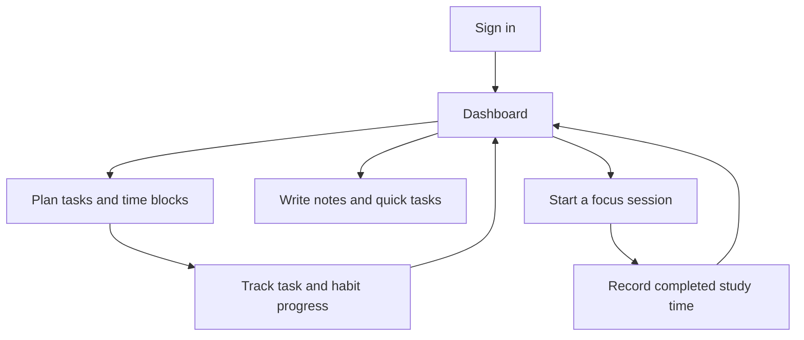
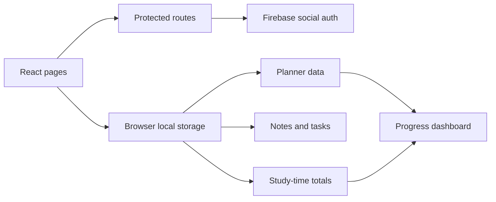

<div align="center">


### A personal study command centre for planning work and protecting focus time.

[](https://studydash-one.vercel.app/)
[](https://github.com/nupoor-mahajan/studydash)


</div>

---

## Why StudyDash?

Student work is usually scattered between calendars, to-do lists, notes, habit trackers and timer apps. **StudyDash** brings those workflows into one responsive dashboard so students can plan their day, focus on a session and immediately see their progress.

The project combines a calendar planner, time blocking, task tracking, study analytics, quick notes and a focus timer in one interface. Most productivity data is stored locally in the browser, while Google and GitHub sign-in are supported through Firebase Authentication.

## Product highlights

| Workspace | What it provides |
|---|---|
| **Dashboard** | Study-time summary, today's schedule and task-completion chart |
| **Planner** | Calendar, dated tasks, filters and hourly time blocks |
| **Habits** | Custom habits, daily completion and streak calculation |
| **Goals** | Daily and weekly goal capture |
| **Brain dump** | A persistent space for unstructured thoughts |
| **Notes** | Editable sticky notes with local persistence |
| **Quick tasks** | Add, edit, complete and remove to-do items |
| **Focus timer** | Pomodoro, short break, long break and custom sessions |
| **Authentication** | Google and GitHub popup sign-in through Firebase |

---

## Core experience



### Dashboard

- Displays the current date and personalised user information
- Reads completed timer sessions for the current day
- Shows tasks scheduled in today's time blocks
- Visualises completed and pending planner tasks with Chart.js

### Study planner

- Navigate between months and select a planning date
- Add dated tasks and filter them by completion state
- Create time blocks from 6:00 AM to 11:00 PM
- Add, remove and complete daily habits
- Calculate an activity streak from daily habit logs
- Store daily goals, weekly goals and a brain dump

### Notes and tasks

- Create multiple editable sticky notes
- Delete notes when they are no longer needed
- Maintain a separate quick to-do list
- Edit, complete and remove individual tasks

### Focus timer

- 25-minute Pomodoro mode
- 5-minute short break
- 10-minute long break
- Custom minute-and-second countdown
- Circular visual progress indicator
- Alarm audio when a session finishes
- Completed session time added to the current day's study total

---

## Architecture



### Persistence model

StudyDash currently stores these browser-local records:

| Key | Contents |
|---|---|
| `studyPlannerData` | Tasks, time blocks, habits, goals and brain dump |
| `sticky-notes` | Editable notes |
| `todo-list` | Quick tasks |
| `studyTime_YYYY-MM-DD` | Completed focus time for a date |
| `user` | Basic local profile data used by the interface |
| `loggedIn` | Prototype route-access flag |

---

## Technology stack

| Layer | Technology |
|---|---|
| Interface | React 18, TypeScript, Tailwind CSS 3 |
| Routing | React Router DOM 6 |
| Authentication | Firebase Authentication |
| Visualisation | Chart.js, react-chartjs-2 |
| Persistence | Browser Local Storage |
| Build tooling | Vite 5, PostCSS |
| Deployment | Vercel |

---

## Repository structure

```text
studydash/
├── public/
│   ├── alarm_clock.mp3
│   └── logo.png
├── src/
│   ├── components/
│   │   ├── Layout.tsx
│   │   └── Sidebar.tsx
│   ├── hooks/
│   │   └── useLocalStorage.ts
│   ├── pages/
│   │   ├── Dashboard.tsx
│   │   ├── Login.tsx
│   │   ├── Notes.tsx
│   │   ├── Planner.tsx
│   │   └── Timer.tsx
│   ├── types/
│   ├── firebase.ts
│   ├── App.tsx
│   └── main.tsx
├── package.json
└── vite.config.ts
```

---

## Run locally

### 1. Clone and install

```bash
git clone https://github.com/nupoor-mahajan/studydash.git
cd studydash
npm install
```

### 2. Configure Firebase

Create `.env.local` in the project root:

```env
VITE_FIREBASE_API_KEY=your_api_key
VITE_FIREBASE_AUTH_DOMAIN=your_auth_domain
VITE_FIREBASE_PROJECT_ID=your_project_id
VITE_FIREBASE_STORAGE_BUCKET=your_storage_bucket
VITE_FIREBASE_MESSAGING_SENDER_ID=your_sender_id
VITE_FIREBASE_APP_ID=your_app_id
```

In Firebase Authentication, enable the providers used by the application:

- Google
- GitHub

Add your local and deployed domains to the Firebase authorised-domain list.

### 3. Start development mode

```bash
npm run dev
```

### 4. Build and preview

```bash
npm run build
npm run preview
```

---

## Security note

Firebase-based Google and GitHub sign-in use real authentication providers. However, the current custom email/password form is only a frontend prototype: it stores the entered account and password directly in browser Local Storage and guards routes using a local boolean flag.

**Do not use the custom email/password flow with a real password.** Before treating StudyDash as a production application, replace it with Firebase Email/Password Authentication and protect user data using authenticated cloud storage or Firestore security rules.

---

## Current boundaries

- Planner, notes and timer data remain on the current browser and device.
- Google/GitHub sign-in does not currently sync productivity data between devices.
- A user can modify the local route-access flag through browser developer tools.
- Habit streaks count days containing at least one completed habit, rather than requiring every habit.
- Timer progress is saved only when a session reaches zero.
- The repository does not contain automated tests or a declared licence file.
- The production bundle currently triggers a Vite warning because the main JavaScript chunk exceeds 500 kB.

## Roadmap

- Replace local custom credentials with Firebase Email/Password Authentication
- Sync user data securely through Firestore
- Split routes into lazy-loaded bundles
- Add timer recovery after refresh or tab closure
- Add unit tests for streak, timer and planner logic
- Provide data export and account-deletion controls

---

## Verification

The project successfully completes TypeScript compilation and a Vite production build:

```bash
npm run build
```

The verified build generated a production bundle successfully. Vite reported a performance warning for the main JavaScript chunk, which can be improved using route-level dynamic imports.

---

## Built by

**[Nupoor Mahajan](https://github.com/nupoor-mahajan)**  
Computer Engineering student exploring frontend engineering, applied AI and product design.

---

<div align="center">

**One workspace for planning clearly and studying intentionally.**

[](https://studydash-one.vercel.app/)

</div>
